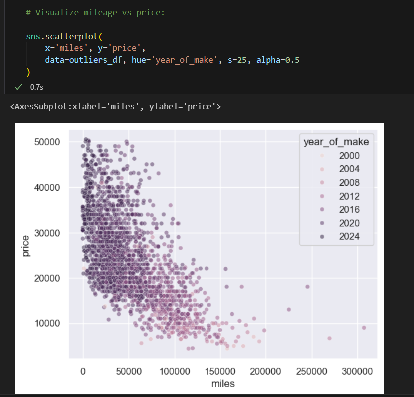

# Used-Cars-Data-Analysis-and-Price-Prediction

Research topic: Predict value of used cars based on factors such as: make and model and year of make of the car, number of accidents, number of owners and mileage.

Data Source: The dataset can be found and dowloaded from the following link https://www.kaggle.com/code/pandu0/car-resale-price-prediction-scikit-learn/input

Dependencies: Following dependencies were imported using the 'import' command:
json, csv, os, matplotlib.pyplot as plt, scipy.stats as st, pandas as pd, numpy as np, requests, time,
datetime, warnings, warnings.filterwarnings('ignore'), from scipy.stats import linregress, hvplot.pandas,
from pathlib import Path, seaborn as sns, from sklearn.preprocessing import StandardScaler, QuantileTransformer, OneHotEncoder,
from sklearn.model_selection import train_test_split, from sklearn.compose import ColumnTransformer
from sklearn.pipeline import Pipeline, from sklearn.impute import SimpleImputer, tensorflow as tf, joblib,
from tensorflow_addons.metrics import RSquare

Data Cleaning: 
- Remove duplicate values in rows;
- Update price and miles columns to integer datatype;
- Create separate columns for make and model of the car;
- Create separate columns for exterior and interior color of the car;
- Reformat number of accidents and number of owners value to return integer values;
- Write reformatted data set to a csv file and create SQL database;
- Retrieve data from SQL database.

Data Analysis:
- With the help of graphs and plots identify factors contributing to determining used car price;
- Remove any outliers.

Initial observations from the graph above:

- The newer models (year of make) are more expensive than the older ones, except that there are some outliers.
- The higher the mileage the lesser the price, except that there are some outliers.
- As the number of accidents increase, the price of the vehicles reduces, except some outliers.

Graph of car price vs car make: 

Following Make have much lower prices than others: 

Chevrolet, Mercedes-Benz, BMW, Porsche, Land, Volvo, Lexus, Acura, Maserati,
Subaru, Audi, GMC, Cadillac, Ram, Alfa, Aston, Genesis, Karma, Scion, Bentley, Saturn.

From the graph above, we can see mileage contributes to determining the price however it is not the only factor determining the price. Other factors such as number of previous owners, accidents, make and model, year of make are also factors determining the price. It is a wholistic view of the car history that determines its price rather than a single factor.

The approach taken to build a model that can take all these factors into consideration and predict a car's fair price was to create a Supervised Learning model. For the purpose of creating a model, data was pre-processed first:

Data Preprocessing:
- Scale and normalize data;
- Define X and y columns.

Data Modelling:
- For the purpose of predicting used cars price, two models were created using RandomForestRegressor and KNeighborsRegressor functions.
- Data was trained and tested.

Random Forest Model returned better results than the KNN Model. KNN model appears to be an overfit.

R2 Score for RandomForestRegressor model is about 0.68, which reflects a fair performing model. The mean squared error is about 5000. This is not a huge value as the minimum car value in this dataset is about 5000 and maximum value is about 50000, given that a variation of about 5000 from a bigger picture perspective is not a big difference. So we can conclude RandomForestRegressor is a good model to predict used car prices. The result of this model performance are presented below in a dataframe and scatter plots.

Model performance results are presented in the scatter plot graphs below:

We created another model using tensorflow to see if we could obtain better results:

Steps to create deep learning model:
1. Define X (independent variables) and y (dependent variables).
2. Split the data into Train and Test datasets with the test_size.
3. Convert categorical data to numeric with OneHotEncoder.
4. Create a QuantileTransformer instance.
5. Fit the scaler and scale the data.
6. Define the model - deep neural net, i.e., the number of input features and hidden nodes for each layer

7. Compile and train the model. Compile metrics was RSquare to predict the car values.
8. Evaluate the model. Plot the results.

Test the model:
1. Create another jupyter notebook, import libraries. 
2. Clean and scale the data.
3. Load the model. 
4. Input the data into the model and predit the values.

The outcome was as follows:

